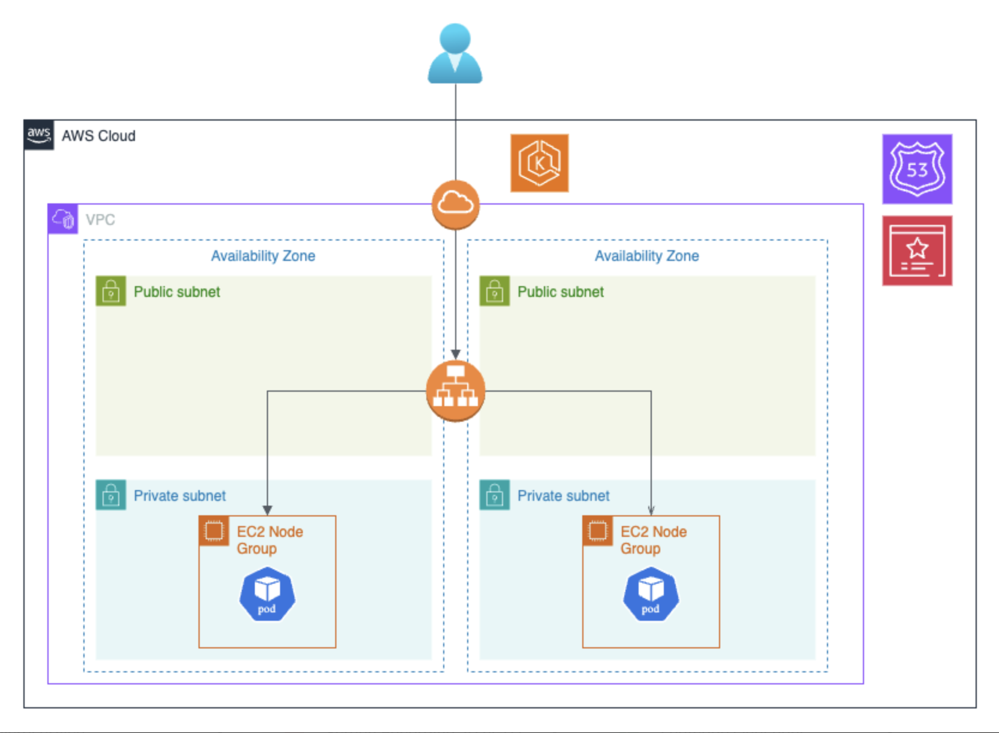
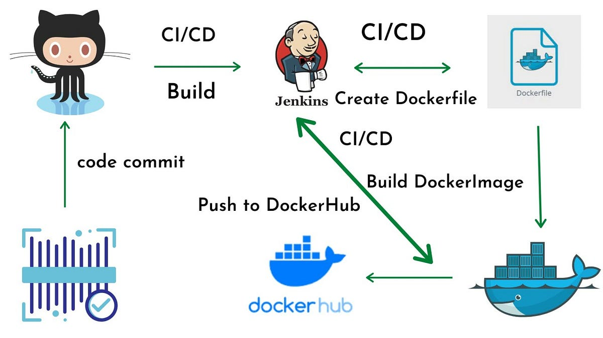

# E-Shop Microservice BE

## Overview

A scalable, microservice-based e-commerce platform designed to handle various aspects of an online shopping experience. The application is built using Kubernetes, Docker, AWS EKS, Jenkins CI/CD, RabbitMQ

## Architecture

The application consists of the following microservices:

-   User Service: Manages user authentication and registration.
-   Product Service: Manages product catalog and inventory.
-   Cart Service: Manages shopping cart functionalities.
-   Order Service: Manages order processing and fulfillment.

## Technology stack

-   **Front-End:** Next, Tailwind CSS
-   **Back-End:** Express + Typescript
-   **Data:** PostgreSQL
-   **Unit Testing:** Jest
-   **CI/CD:** Jenkins
-   **Infrastructure:** AWS EKS (including VPC + EC2), AWS ALB, AWS Route53 & Certificate Manager, AmazonMQ

## CI/CD Pipeline

